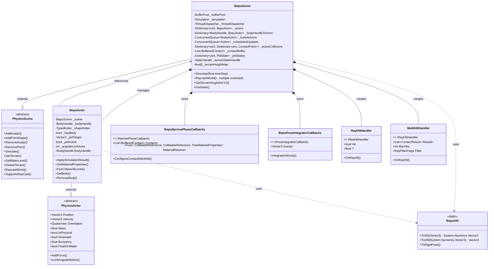
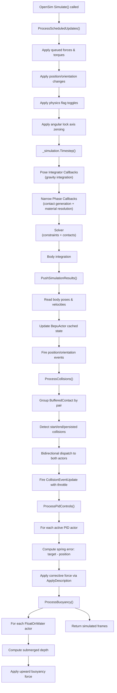
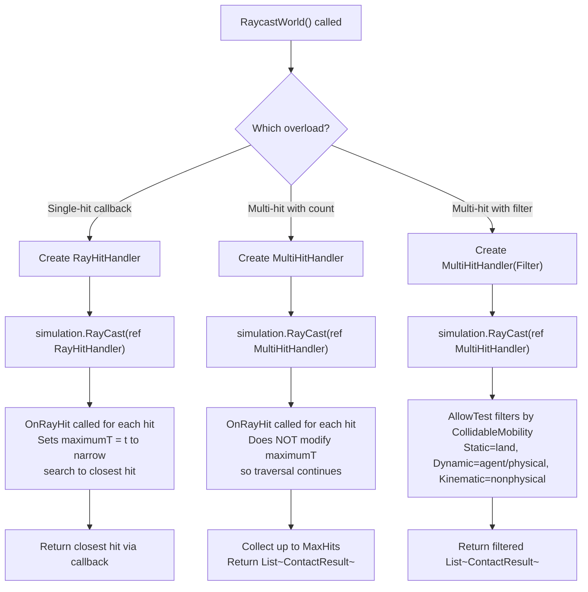

# BepuPhysics v2 Module for OpenSimulator

A replacement physics engine for OpenSimulator using [BepuPhysics v2](https://github.com/bepu/bepuphysics2), a fast and deterministic physics simulation library. Licensed under Apache 2.0.

## Architecture

### Core Types



### Simulation Loop



### Collision Pipeline

```mermaid
flowchart LR
    subgraph NarrowPhase [Narrow Phase - Worker Threads]
        NP["BepuNarrowPhaseCallbacks.ConfigureContactManifold()"]
        NP --> MR["MaterialResolver( pairA, pairB )<br/>returns PairMaterialProperties"]
        MR --> RC["ReadContactsFromConvex()"]
        RC --> CB["Append BufferedContact to _contactBuffer"]
    end

    subgraph MainThread [Main Thread - After Timestep]
        PC["ProcessCollisions()"]
        PC --> GROUP["Group contacts by CollidablePair"]
        GROUP --> MAP["Map BodyHandle/StaticReference → BepuActor"]
        MAP --> DETECT["Detect start / end / persisted"]
        DETECT --> FIRE1["BepuActor.FireCollisionEvents()"]
        DETECT --> FIRE2["BepuActor.FireCollisionEvents()"]
        FIRE1 --> T1["Throttle check (100ms)"]
        FIRE2 --> T2["Throttle check (100ms)"]
        T1 --> SEND["SendCollisionEventUpdate()"]
        T2 --> SEND
    end

    CB --> PC
```



### Raycasting



## Phases

| Phase | Status | Description |
|-------|--------|-------------|
| 1 - Exploration | ✅ Done | Analyzed BulletSim patterns, studied Bepu v2 API |
| 2 - Core Skeleton | ✅ Done | Simulation lifecycle, terrain, basic body management |
| 3 - Abstract Contract | ✅ Done | All 48 PhysicsActor members, all PhysicsScene overrides |
| 4 - Collision Pipeline | ✅ Done | Narrow phase callbacks, contact buffering, collision dispatch |
| 5 - Per-Actor Control | ✅ Done | Materials, PID/MoveTo, buoyancy, angular lock, gravity |
| 6 - Terrain Mesh | 🔲 Pending | Build real Mesh from heightmap instead of flat box |
| 7 - Buoyancy/Vehicles | 🔲 Pending | Water plane collision, vehicle constraints |

## Files

| File | Lines | Role |
|------|-------|------|
| `BepuScene.cs` | 1261 | Main scene: simulation, terrain, raycasts, collisions, PID, buoyancy |
| `BepuActor.cs` | 644 | Actor: all PhysicsActor members, collision events, material/PID helpers |
| `BepuUtil.cs` | 66 | Type conversion between OpenMetaverse and System.Numerics |
| `TRACKING.md` | 68 | Project tracker with progress and dependencies |

## Build

```bash
# Requires .NET 9 SDK and BepuPhysics NuGet
./runprebuild.sh
dotnet build -c Release OpenSim.sln
```
